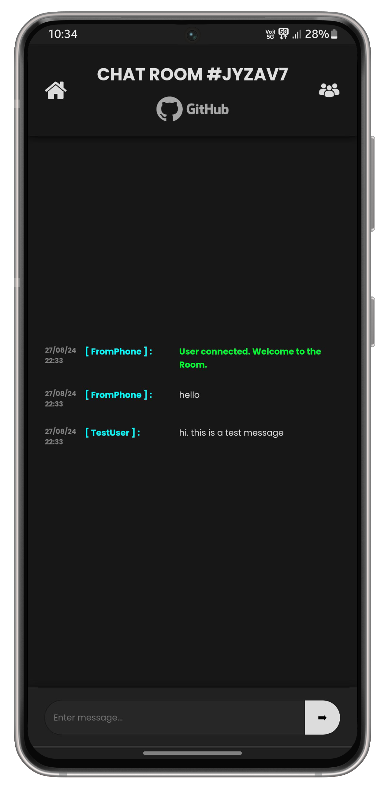

# Web Chat-Hub Application built on Flask #

An web-based chat application built with Flask, enabling users to exchange text messages anonymously within a "chat room".

Users can create new rooms or join existing ones to communicate with others in the same room.

#### Check out the project Live : [Hosted on Render](https://flask-chathub.onrender.com/) 
`https://flask-chathub.onrender.com/` 
####

## Setup ##

Recommended Python `3.6` or above. 

- Set up python virtual environment:
```bash
python3 -m venv .venv
```
- Activate the virtual environment:
```bash
source .venv/bin/activate
```
- Installing dependencies:
```bash
python3 -m pip install -r requirements.txt 
```

## Execution ###
With the virtual environment activated, run the following commands.

- To run locally:
```bash
flask run
```
- To run on the network:
```bash
flask run --host "0.0.0.0"
```
## Features ##
- Completely anonymous
- Real-time messaging
- Auto-Generated Room IDs
- Dynamic room creation and deletion without server restart
- Temporary rooms: Inactive/Vacant rooms are periodically deleted
- Users list broadcast
- Responsive design for easy viewing on all devices

## Screens ##
 <br>



## Resources ##
- https://docs.python.org/3/library/hashlib.html
- https://flask-socketio.readthedocs.io/en/latest/
- https://socket.io/docs/v4/client-installation/
- https://github.com/socketio/socket.io-client/issues/1451

## // TO-DO: ##
- ~~Standardize front-end~~
- ~~Implement Room Creation/Joining~~
- ~~Implement WebSocket for individual Rooms~~
- ~~Connected users list~~
- Session based auth (probably)
- Message history (probably)
- ~~Deploy if free~~